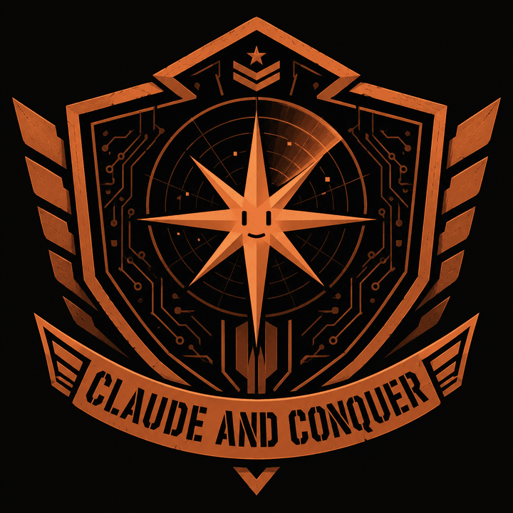

<p align="center">
  
</p>

# Claude and Conquer

**Command & Control center for a pool of VPSes + Claude subscriptions — coding at super scale.**

One commander (you + Claude on the **main box**) directs a fleet of worker VPSes. The main box runs
this repo and mirrors the whole workspace at `~/workspace/<org>/<repo>`, so the commander can read the
real code locally. Each worker is one **team**: a coding agent ready (`claude` = Anthropic Max, or
`glm` = z.ai GLM), repos cloned, `claudetm` installed. You paste a `/goal`, the commander picks the
idlest box, makes sure the code + secrets are there, dispatches the mission, PRs merge sequentially,
and the flight controller verifies the work actually **deployed**.

```
        ┌─────────────────────────┐
        │  COMMANDER (main box)   │  /goal … → cnc goal   (runs this repo)
        └────────────┬────────────┘
      ┌──────────────┼──────────────┐
      ▼              ▼              ▼
  ┌────────┐     ┌────────┐     ┌────────┐
  │worker-1│     │worker-2│     │worker-3│   1 VPS = 1 team = 1 coding-agent sub
  └───┬────┘     └───┬────┘     └───┬────┘
      ▼              ▼              ▼
  parallel agents → PRs → claudetm merge-pr (sequential) → GitOps deploy → deploy-check
```

## The idea

- **1 VPS = 1 team**, running a coding agent — `claude` (Anthropic Max) or `glm` (z.ai GLM).
- **Every box mirrors the whole workspace** at `~/workspace/<org>/<repo>` — identical to local.
- **C&C makes sure the stuff is there:** every repo cloned + its `.env` delivered from Bitwarden
  (workers can't reach the vault — only the main box can). The **agent does the rest** itself: deps,
  build, tests, PRs.
- **The commander picks the box:** `cnc goal` round-robins by state/load across ready boxes — any box
  can run any goal, since all mirror the workspace. `--team` / `--pool` override.

## Workflow

Inside a Claude session on the main box, use **`/goal <text>`** — the commander enriches the goal with
standing orders (parallel agents, sequential `claudetm merge-pr`, verify gate, ship to
`../infrastructure`, 100% completion) and dispatches it to the idlest ready box. That box's agent does
the deep, full work. **The main agent just launches the agents on the worker VPSes.**

```bash
/goal use parallel agents, claudetm merge-pr each PR, deploy to ../infrastructure —
      finish the dashboards, find bugs, refactor, 100% complete
```

**How the commander picks a box.** Since every box mirrors the whole workspace, `cnc goal`
**round-robins by state/load** — it picks the least-busy, coolest-burn ready box and pre-flights that
box's active 5h window via `ccusage`, refusing a hot subscription (raise `CNC_BURN_LIMIT` or `--force`
to override). Right before handoff it makes sure the stuff is there (clone if missing + deliver the
`.env`), so the agent just codes. Because the main box also holds the `~/workspace` clones, the
commander can **read the real code locally to consult** while missions run elsewhere. Each box can run
**different coding agents** (`cclaude` = Anthropic Max, `cclaudez` = z.ai GLM, …) — see
[docs/agents.md](docs/agents.md).

## Fork it

This repo is a **template**. Fork it, clone your fork, start Claude, and run **`/setup`** — Claude
interviews you for servers + projects + orgs, writes the inventory, provisions every VPS, and hands
you the auth checklist. The **only** step that can't be automated is the Claude subscription login:

```bash
bin/cnc ssh <team> --login            # /login the Claude subscription on that box
```

GitHub access is propagated for you: `bin/cnc gh-setup <team>` copies the main box's ssh key + `gh`
token so each worker clones and pushes with the **same access as the commander** (`cnc provision`
runs it automatically).

## Quick start

```bash
bin/cnc teams                 # inventory
bin/cnc status                # fleet health: ssh, claude auth, disk, active goals
bin/cnc accounts              # which subs are logged in (human does: cnc ssh <t> --login)
bin/cnc usage --days 7        # how hard each subscription is being pooled

# stand up a box
bin/cnc provision worker-1    # gh-setup + bootstrap (tools + Chromium) + optimize
bin/cnc sync-repos --all      # put every repo + its .env on every box (mirror the workspace)

# secrets live on the MAIN box only (workers just code):
bin/cnc secrets acme --set-creds acme --sync   # render ~/workspace/acme/.env from its vault
bin/cnc bw acme -- get notes ".env webapp"     # ad-hoc secret pull for a Claude session

# run missions
bin/cnc goal "finish the dashboards — 100% complete" --project acme/webapp
bin/cnc goals                          # flight log
bin/cnc deploy-check acme/webapp       # did it actually ship?
```

## Commands

| group | command |
|---|---|
| fleet | `teams` · `status` · `accounts` · `usage` · `ssh` · `exec` |
| provision | `bootstrap` (+ Chromium) · `gh-setup` · `optimize [--persist]` · `provision` (all-in-one) · `sync-repos` |
| secrets (main box only) | `secrets <org> [--set-creds <org>] [--sync]` · `bw <org> [-- <bw args>]` |
| scaffold | `new-team` · `new-project` |
| missions | `goal` · `goals` · `projects` · `deploy-check` |

Selectors: `--all` · `--pool <p>` · `--tag <t>` · `<team-id>…`

## Map

| where | what |
|---|---|
| `fleet/teams/*.yml` | team inventory — schema in [fleet/CLAUDE.md](fleet/CLAUDE.md); copy `_example.yml` |
| `fleet/box/` | files pushed to boxes — `bw-sync.ts` (secrets), `agents.sh` (coding-agent aliases) |
| `projects/<org>/<repo>/` | registry: concise-English README + project.yml + goals/ — schema in [projects/CLAUDE.md](projects/CLAUDE.md); see `projects/_example/` |
| `orgs/<org>/bw.yml` | per-org Bitwarden connection + secret manifest (non-secret) — schema in [orgs/CLAUDE.md](orgs/CLAUDE.md); see `orgs/_example/` |
| `bin/cnc` | the CLI (Bun, zero deps) |
| `scripts/` | `fleet/` `goal/` `projects/` `deploy/` + `lib/` |
| `.claude/` | `/goal` `/setup` commands + fleet/missions skills |
| `docs/` | [**flows**](docs/flows.md) (how `/goal` runs) · [architecture](docs/architecture.md) · [operations](docs/operations.md) · [economics](docs/economics.md) · [onboarding](docs/onboarding.md) · [secrets](docs/secrets.md) · [agents](docs/agents.md) |

## Principles

- **1 VPS = 1 team = 1 org.** Same layout everywhere: `~/workspace/<org>/<repo>`.
- **Mirror everything.** Every box has every repo + its `.env`; the commander round-robins goals by load.
- **Humans do OAuth.** Subscription logins can't be automated — `cnc ssh <team> --login`.
- **No secrets in this repo.** Account *emails* and Bitwarden *server URLs* are identity, not credentials.
  Master passwords, API keys, and tokens live **only on the box** — see [docs/secrets.md](docs/secrets.md).
- **Merged ≠ done.** A mission ends when `deploy-check` is green.
